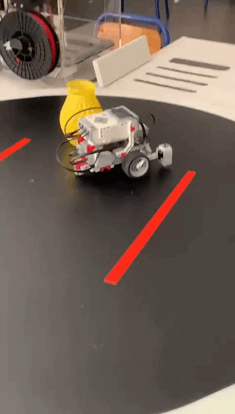

<h3 align="center">Lego Robot Sumo</h3>

    <b>Le programme de lego robot qui nous a permis de remporter tout nos combats de sumo EV3 en classe de première au lycée français international André Malraux</b> 
     
    
    
    

